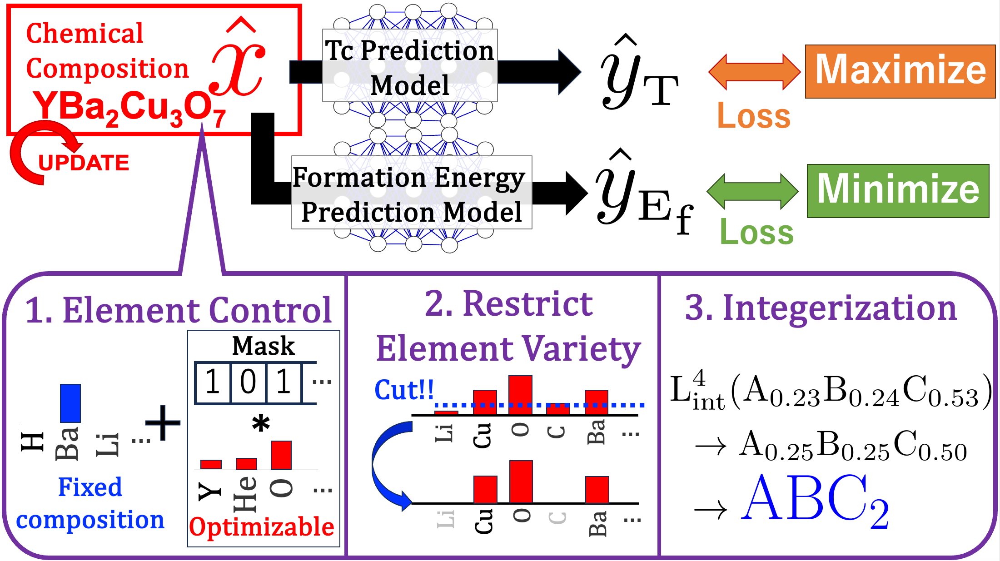

# Knowledge-Integrated Adaptive Gradient-based Optimisation (KIAGO) for Superconducting Materials Design


## Summary
**Knowledge-Integrated Adaptive Gradient-based Optimisation (KIAGO)** is a framework for superconducting materials design that leverages domain knowledge to guide the optimisation process. The framework is based on a gradient-based optimisation algorithm using deep learning property prediction models. KIAGO can flexibly incorporate physical insights, such as elemental composition, oxidation states, and charge neutrality, in an adaptive manner. Our experiments demonstrate that KIAGO outperforms conventional elemental substitution and generative models in proposing high-$T_c$ candidates efficiently. KIAGO can propose high-$T_c$ candidates without being limited by the original distribution, and it can maintain charge neutrality and oxidation states perfectly. Moreover, KIAGO can propose candidate compositions that share the same elements as hydride superconductors reported in other literature despite their absence from the SuperCon dataset. These results highlight the potential of KIAGO for discovering novel materials.



## Paper
For detailed information, please refer to our paper:

[A Straightforward Gradient-Based Approach for High-Tc Superconductor Design: Leveraging Domain Knowledge via Adaptive Constraints](https://arxiv.org/abs/2403.13627)

## Prerequisites
Download pre-trained models and other files from the following link.
https://drive.google.com/drive/folders/1WBcDbxnqJiP2eZz0AuQ1m5lMbWnSMdSw?usp=sharing

Place pretrained models (`baseline_surrogate.pt` and `elemnet.pth`) in the `models/surrogate_model` directory.
Place periodic table representation (`AtomMap-base.npy`) and preprocessed dataset (`random-0.05-0.15-balancing.npz`) in the `./` directory.


## Requirements

### Dependencies


This project uses Python, PyTorch (with CUDA 12.4), and other scientific libraries.  
We use `venv` for environment isolation, install PyTorch manually via `pip`, and manage remaining dependencies with `Poetry`.

### 📦 Environment Setup Instructions (venv + pip + poetry)


#### 1. Create a virtual environment (Python 3.10)

```bash
python3.10 -m venv venv
source venv/bin/activate  
```

#### 2. Install Poetry (if not installed)
```bash
curl -sSL https://install.python-poetry.org | python3 -
export PATH="$HOME/.local/bin:$PATH"

```
#### 3. Install related libraries using Poetry
```bash
poetry install --no-root
```

#### 4. Install PyTorch (CUDA 12.4) and related libraries
These libraries have complex dependencies (especially CUDA compatibility) and must be installed manually via pip.

```bash
pip install --upgrade pip

# Install PyTorch with your CUDA version (e.g. 12.4)
pip install torch==2.6.0 torchvision==0.21.0 torchaudio==2.6.0 --index-url https://download.pytorch.org/whl/cu124
```

### Train models by yourself
The preprocessed dataset (`random-0.05-0.15-balancing.npz`) can be downloaded from the Google Drive link above. You can start training immediately using this file. If you wish to preprocess the data on your own, follow the steps below.

#### Dataset Preparation
If you wish to preprocess the data on your own, follow the steps below.

First, download the [Crystallography Open Database (COD)](http://www.crystallography.net/cod/)と [SuperCon Dataset](https://doi.org/10.48505/nims.3837), and place them in the `./data/raw/` directory.

Then, run the following commands to preprocess the data:
```bash
poetry run python data_process_scripts/create_COD_intermid.py # Create intermediate files for the COD dataset
poetry run python data_process_scripts/create_SuperCon_intermid.py # Create intermediate files for the SuperCon dataset
poetry run python data_process_scripts/prepare_processed_dataset_.py # Merge the two into a training dataset file: random-0.05-0.15-balancing.npz
```


### Training a $T_c$ prediction model
After preparing the dataset, run the following command to train the model:
 
```bash
poetry run python forward_train.py
```

### Training the ElemNet, formation energy prediction model
Follow [the official implementation](https://github.com/NU-CUCIS/ElemNe) to train ElemNet.
Note: The official implementation is based on TensorFlow 1.x. You will need to convert the trained weights to PyTorch format (e.g., via ONNX) for use in this project.

## Usage
To run the code, please execute the following command.
When you run this code, you will conduct three experiments in our research paper: 1. Generating superconductors with higher $T_c$ based on existing ones. 2. Element substitution 3. Proposing novel hydride superconductors.

```bash
poetry run python main.py
```
### Overview of the main script
In main.py, the main_experiment function is a function that executes the experiment, and in InverseOpt4PeriodicTable function, hyperparameters are reflected, and then optimization of the inverse problem is performed by InvModule4PeriodicTable instance.
Here, we give noise to the base material (YBa2Cu3O7) to create 4096 initial values, and optimize them simultaneously. The optimization is performed in two stages: first, the composition is optimized without converting composition ratios into integers, and then the composition is optimized with a special loss to convert compositional ratios into integers. The results are output to the results4inverse directory.

## Output files
In the `results4inverse` directory, the optimization results of the base material are output. The main output is a csv file that outputs the results of the 4096 samples optimized. The npz file is an intermediate file for constructing the csv. The overview of each column is as follows.
- `Initial Optimized Composition`: Result of composition optimization (first stage without integerization)
- `Rounded Optimized Composition`: Composition formula after further optimization using the integerization loss above (second stage optimization)
- `Rounded Optimized Tc`: Predicted Tc after second stage optimization
- `Initial Optimized Tc`: Predicted Tc after first stage optimization
- `Rounded Optimized Ef`: Predicted formation energy after second stage optimization
- `Initial Optimized Ef`: Predicted formation energy after first stage optimization
- `structure_atom_count`: Number of atoms in the optimized composition

## Convex hull evaluation
In this study, we evaluate the convex hull of proposed materials using formation energies predicted by ElemNet.  
Specifically, we retrieve the required materials from the Materials Project and the Alexandria Materials Database, and perform the evaluation with `pymatgen`.

To run the evaluation, write your Materials Project API Key into the `API_KEY` variable in `convex_hull_test.py`, and then execute:

```bash
poetry run python convex_hull_test.py
```

Here, as examples, we perform inference on `O5.0Ca2.0Ba2.0Au2.0` and `Ce0.0483Ga0.1729Gd0.2178La0.0929Nd0.2338Sm0.2343Ir1.0Si1.0`.  To change the inference targets, modify lines 1013 to 1016.
